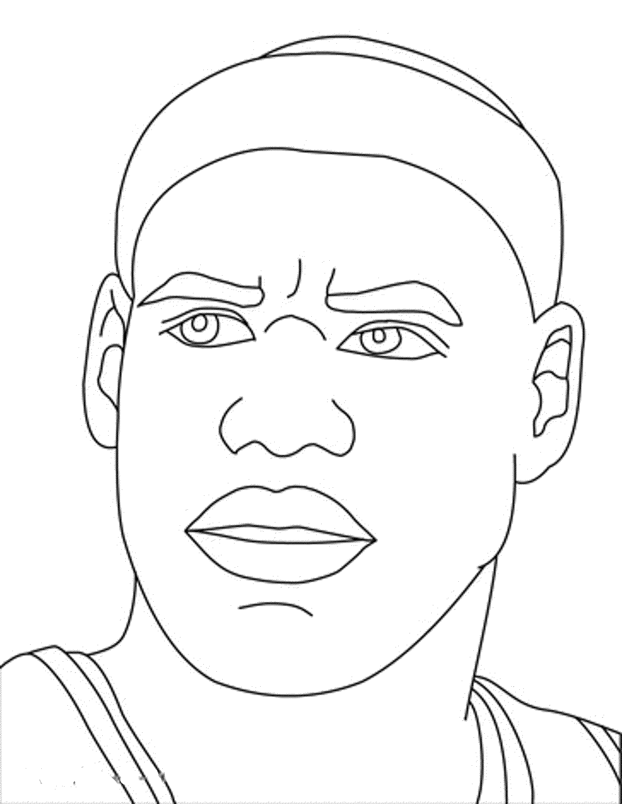
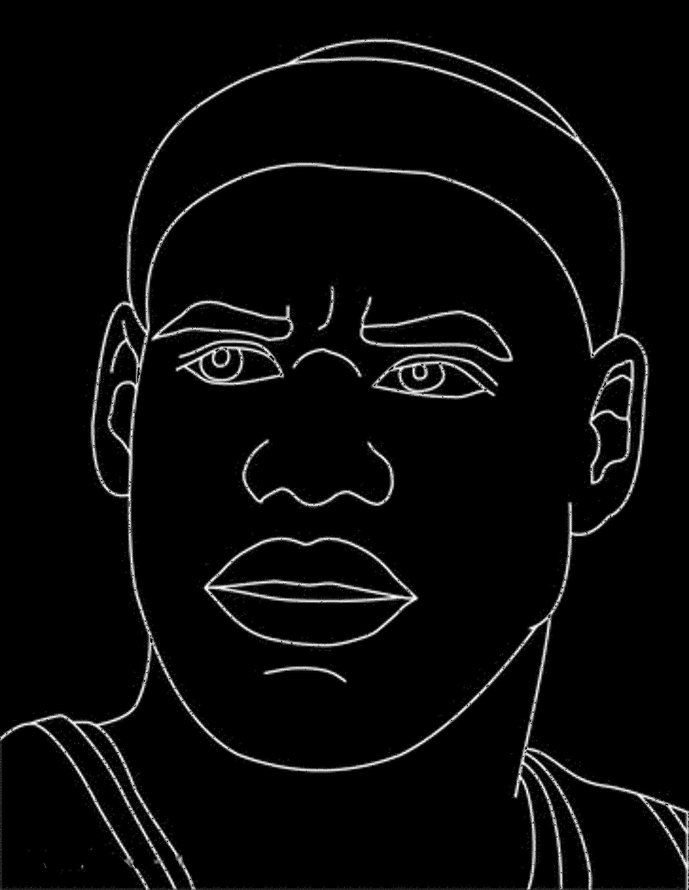

# escritura
converting a 3D printer into a handwriter

## project status
beginning stages. achieved local control of my 3D printer. hardware v1 is setup and working.
improvements of the hardware and software will now come along simultaneously.

## how it works
### 1) image analysis
first, an image is taken and converted to grayscale. it is then binarized based on intensity to clearly distinct foreground from background. finally, a skeletonization process is applied to strip line thickness in an image.

<div style="display: flex; justify-content: center; align-items: flex-start; gap: 20px; text-align: center;">
    
    
</div>

*Original (left) vs. Output (right)*

#### effect of skeletonization

<div style="display: flex; justify-content: center; align-items: flex-start; gap: 20px; text-align: center;">
    
    
</div>

*Original (left) vs. Output (right)*

## setup
- utilizes a virtual environment to prevent any dependency failures.
```bash
python -m venv venv
venv\Scripts\activate # or venv\bin\activate for linux/mac
```
- install the required dependencies in requirements.txt
```bash
pip install -r requirements.txt
```
- figure out your printer's SERIAL_PORT. on a Windows Laptop, this requires tethering to the printer with a data transferrable cable and looking for the serial port in Device Manager -> Ports (ex. "COMX"). add this in a ".env" file:
```bash
SERIAL_PORT="COMX"
```

## resources
- onshape CAD [design](https://cad.onshape.com/documents/caf7562e78c47587bf29c878/w/bd480228ca93c53cb87818c5/e/4580821fba35302cd3dd0ef3?page=2&email=karan.chawlad%40gmail.com&renderMode=0&uiState=6a41ccb5f0dc84344710a03e "go to CAD")